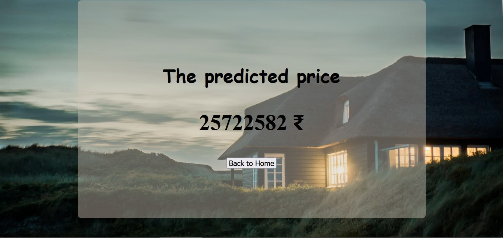

## House price Prediction

This Project has been developed using python programming. This project focuses on predicting house prices based on what features you entered. The data is stored in  and retrieved from a CSV file, with that data we can create a machine learning model and use the model in production. Then Frontend side HTML & CSS used here and Django web framework integrated with HTML, project full work as web based system. Users can access the website from anywhere for free. Here the web site has two web pages, one is for entering features after entering features price is predicted with the help of machine learning model. The output is shown in text format. This project is useful for people who are new to chennai, if they need the house price, they can use it.

Web Page

